## Arcanum

A sample local Git web interface. Based on homework for [15th Yandex Interface Development School](https://academy.yandex.ru/schools/frontend) (2019, autumn).

Created with [create-next-app](https://github.com/vercel/next.js/tree/canary/packages/create-next-app).

### Features

- listing local repos and switching between them
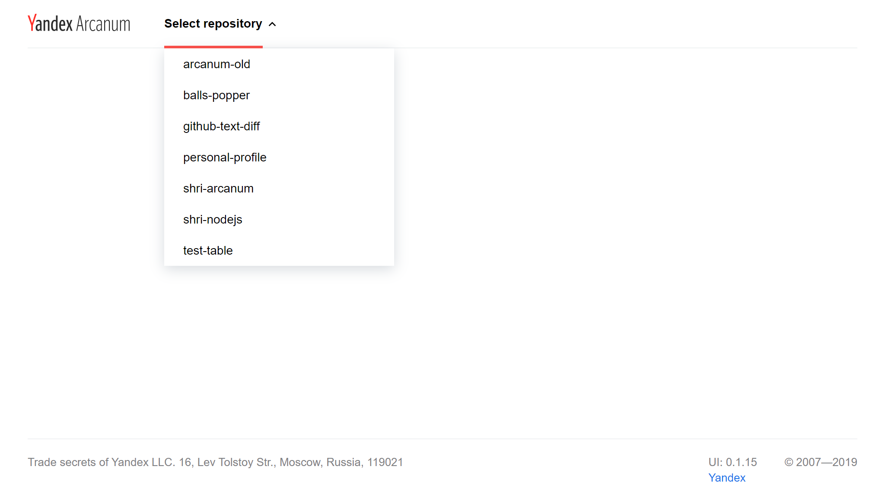
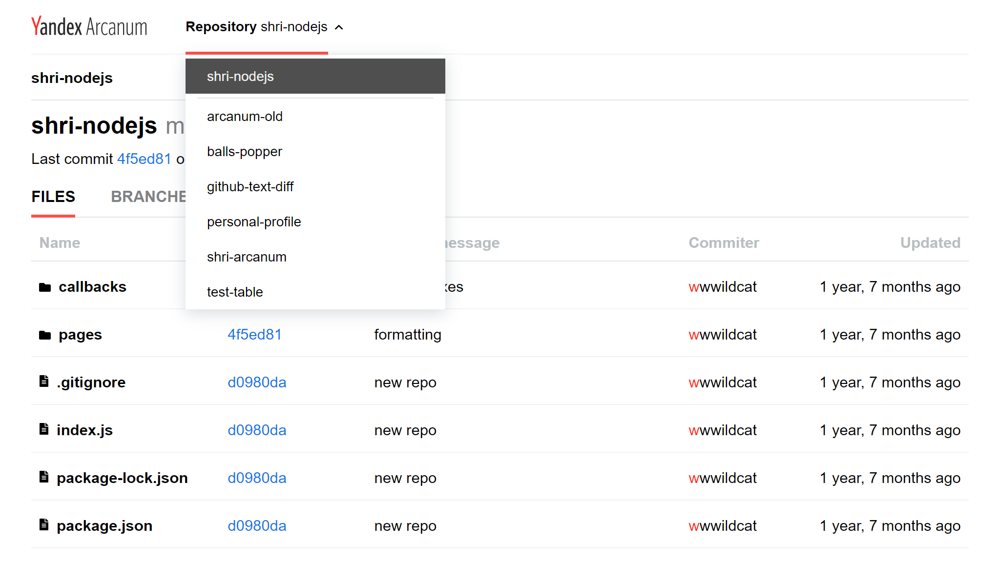
<p>
    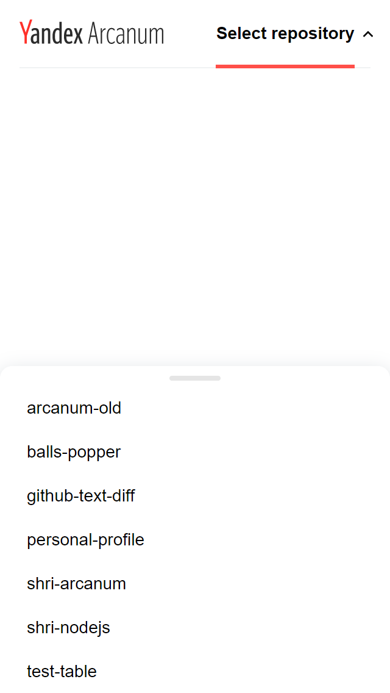
    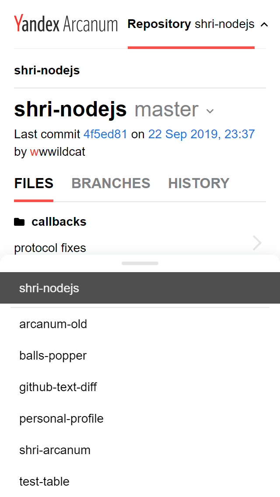
</p>

- file structure explorer to browse all files and folders within the repo
<p>
    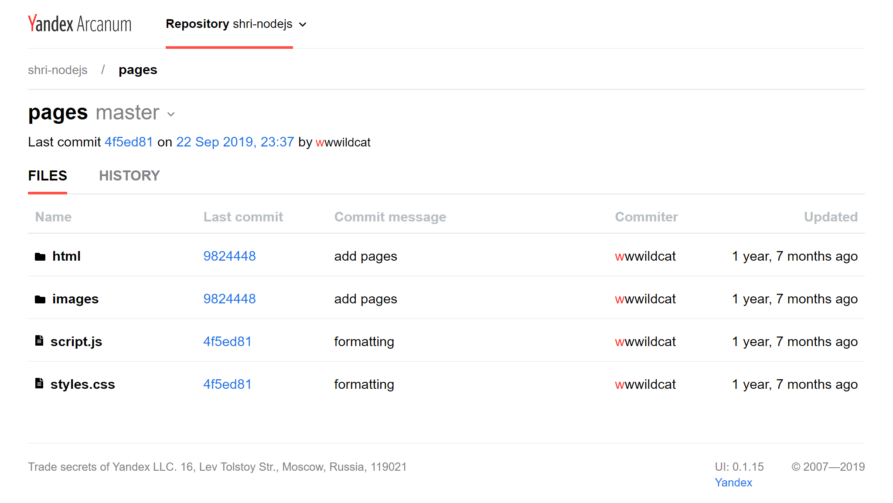
    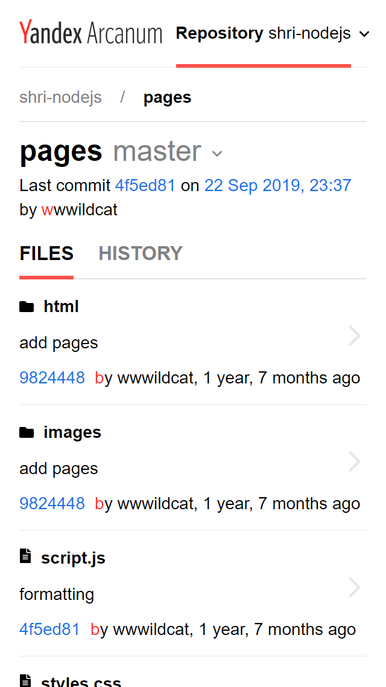
</p>

- file viewer to show file content and file size
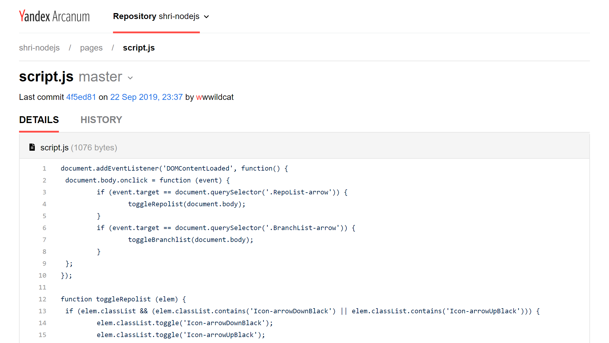

- last commit info for selected file or folder
- listing local branches (both for the entire repo and for its files and subfolders) and switching between them
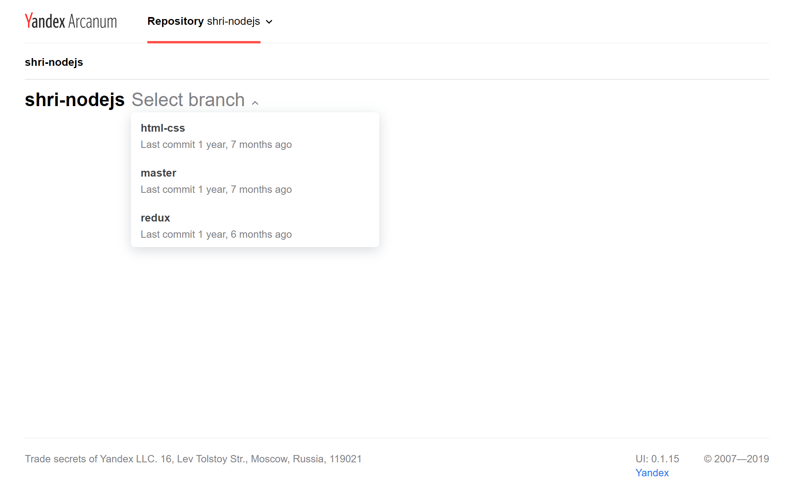
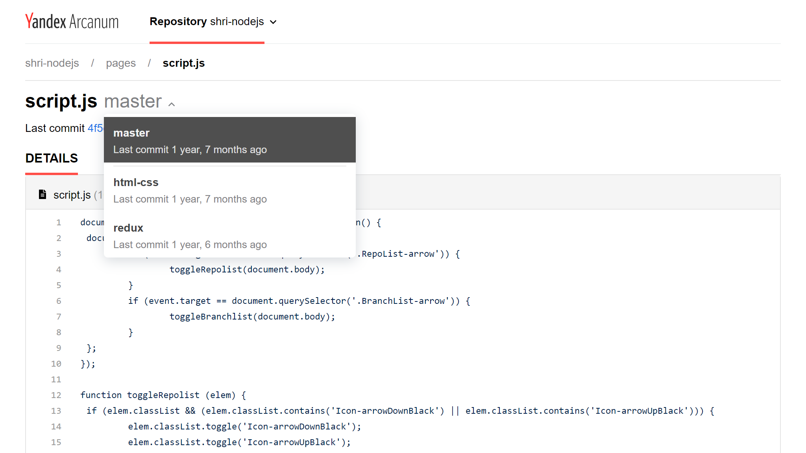
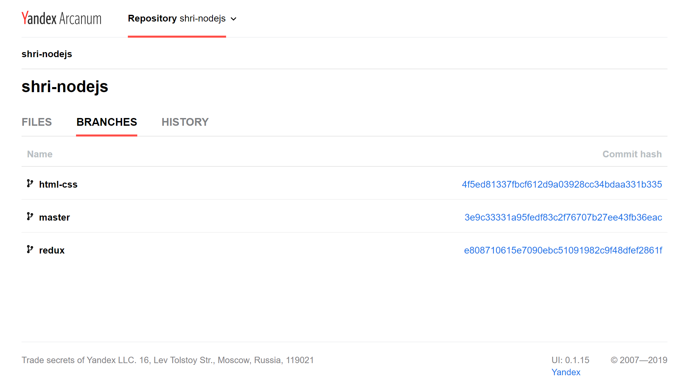
<p>
    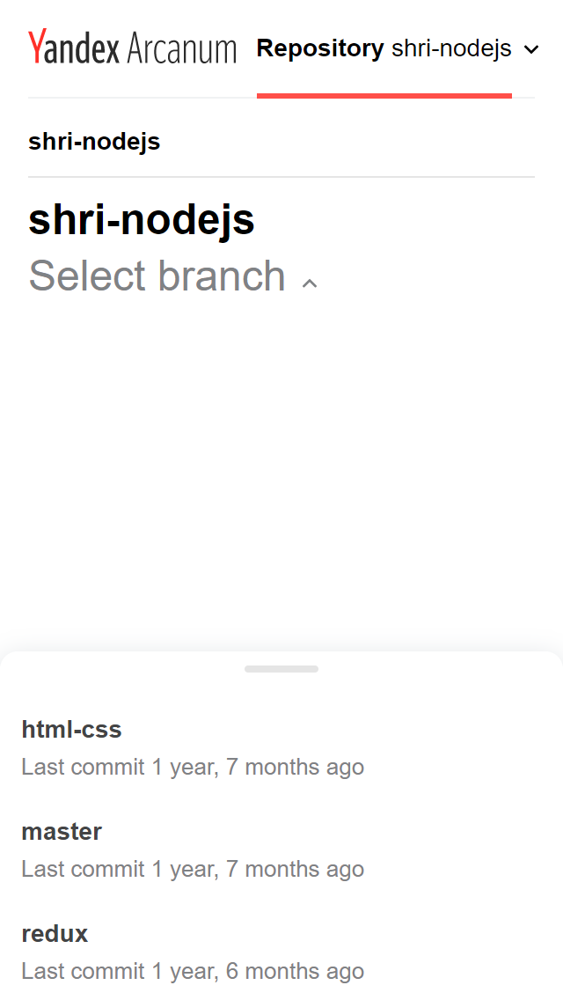
    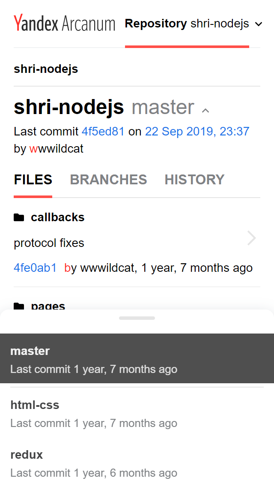
    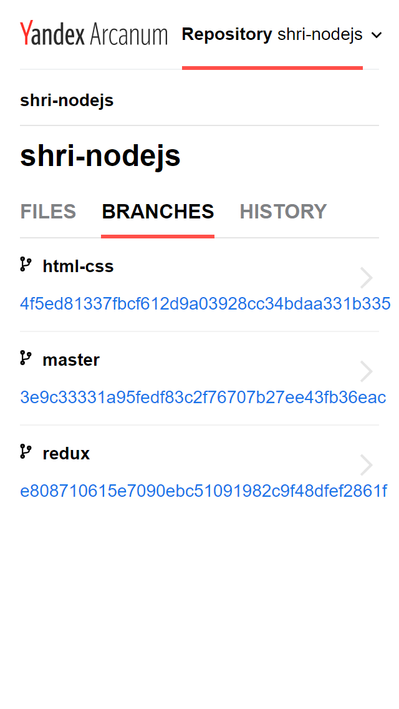
</p>

### Technologies

- [Next.js](https://github.com/vercel/next.js/)
- [TypeScript](https://github.com/Microsoft/TypeScript)
- [Redux](https://github.com/reduxjs/redux)
- [react-redux](https://github.com/reduxjs/react-redux)
- [redux-thunk](https://github.com/reduxjs/redux-thunk)
- [node-sass](https://github.com/sass/node-sass)

### Requirements

- [NodeJS](https://nodejs.org/en/) ^14.x
- [Git](https://git-scm.com/) ^2.29

### Usage & development

0. Install [yarn](https://classic.yarnpkg.com/en/docs/install) if needed.
1. `git clone https://github.com/wwwildcat/shri-arcanum.git`
2. Create a file called `.env` on the root of the project and add the `BASE_PATH` variable:
```
BASE_PATH='path'
```
where `path` is your absolute path to local directory that contains Git repositories, example: `/home/user/repos`.

3. `yarn install`
4. `yarn dev`
5. URL: [http://localhost:3000](http://localhost:3000)

### Unit testing

```
yarn test
```

Using [Jest](https://github.com/facebook/jest), [react-testing-library](https://github.com/testing-library/react-testing-library), [jest-dom](https://github.com/testing-library/jest-dom) with [redux-mock-store](https://github.com/reduxjs/redux-mock-store), [node-mocks-http](https://github.com/howardabrams/node-mocks-http) and [jest-fetch-mock](https://github.com/jefflau/jest-fetch-mock).